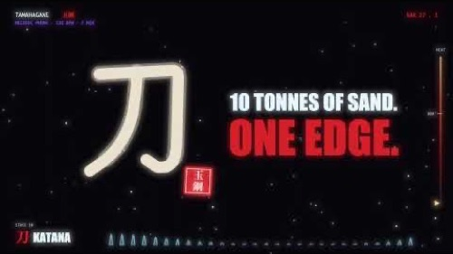
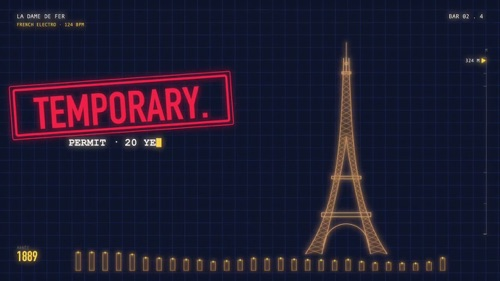
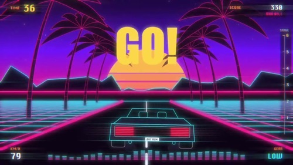
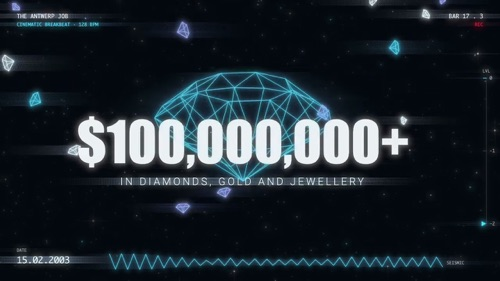
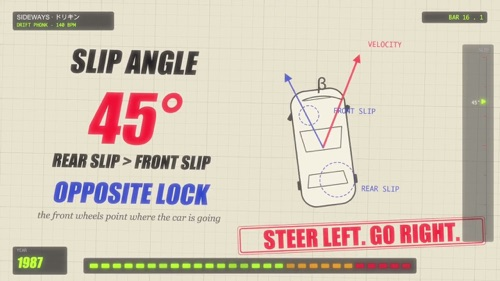
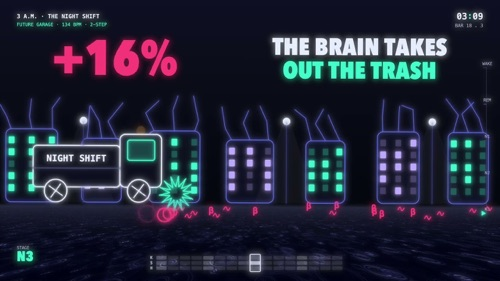
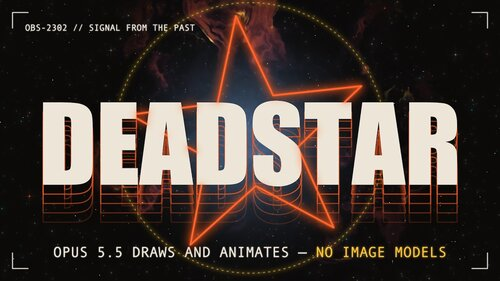
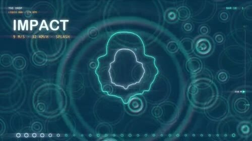
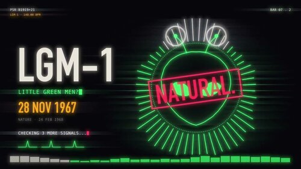

# Motion graphics music video noimage — native Mac edition

A Claude Code skill and plugin for creating music videos from a song and a creative prompt, built specifically for **macOS**. This repository is a fork of [makevoid/motion-graphics-music-video-skill](https://github.com/makevoid/motion-graphics-music-video-skill).

Most visual and sound generation uses **Swift**: Core Graphics and Core Text draw scenes and typography, Metal renders shaders, particles and glow, AVFoundation exports video, and the Swift sound synthesizer and VFX renderer provide the finish. Ruby coordinates the toolkit and writes scene descriptions; local Python handles audio analysis, stem separation, cutouts and mixing.

This is the **no-image-generation fork**. It builds motion graphics from code and can use supplied assets. GPT Image 2.5, Nano Banana and MiniMax H3 image/video generation have been removed. The default Swift workflow needs no Fal API key or credits. Fal audio support remains available for future use: Music3, Stable Audio SFX, Whisper transcription and Demucs stem separation, with the shared client and schema tools retained.

### NOTE

Use the installation commands below for this fork. Its plugin, marketplace, skill and MCP server names use the `-noimage` suffix so they can coexist with the original plugin.

This plugin has been tested few times and consistently seems to produce great results without the downside of spending for FAL AI credits for MiniMax H3. This plugin draws/generate everything with local Swift tools, it's super fast and you can get great results with little iterations and render time.

[Skill instructions](.claude/skills/motion-graphics-music-video-noimage/SKILL.md) · [Native workflow](.claude/skills/motion-graphics-music-video-noimage/references/native-workflow.md) · [Task reference](.claude/skills/motion-graphics-music-video-noimage/references/tasks.md) · [Testing](.claude/skills/motion-graphics-music-video-noimage/references/testing.md)

## Videos created with this skill

Nine examples drawn entirely with the native Swift renderer — no image or video models. Click a thumbnail to watch on YouTube.

| Tamahagane | La Dame de Fer | Out Run |
| :---: | :---: | :---: |
| <a href="https://youtu.be/hHb8Gu9tRzU"></a> | <a href="https://youtu.be/komOer1qUrI"></a> | <a href="https://youtu.be/k94Ke_BWAW0"></a> |
| ElevenLabs Music v2.5 · 0:48 | ElevenLabs Music v2.5 · 0:45 | ElevenLabs Music v2.5 · 1:21 |

| The Antwerp Job | Sideways | 3AM |
| :---: | :---: | :---: |
| <a href="https://youtu.be/YsLnhQM2dU0"></a> | <a href="https://youtu.be/r_vNIBrlzsA"></a> | <a href="https://youtu.be/ecoT5Yz8iGA"></a> |
| ElevenLabs Music v2.5 · 0:49 | ElevenLabs Music v2.5 · 1:16 | 1:01 |

| Dead Star | The Drop | LGM-1 |
| :---: | :---: | :---: |
| <a href="https://youtu.be/2Sw3KnEUA1w"></a> | <a href="https://youtu.be/f4qpElPt1kU"></a> | <a href="https://youtu.be/jBSBVTApLDY"></a> |
| @madebyanubis · Suno · 1:58 preview | 1:00 | 0:56 |

This is also the skill that generated [the music video posted by @makevoid on X](https://x.com/makevoid/status/2106038781610451310).

## Requirements

- **macOS 14+** with Swift 5.9+ / Xcode command line tools. The rendering backend depends on Apple frameworks.
- Ruby 3.2+ with Bundler; the older Ruby bundled with macOS is insufficient.
- FFmpeg / ffprobe, ImageMagick and Python 3.
- `uv` for local stem separation, music mapping and optional transcription. Local MLX transcription requires Apple Silicon.
- Claude Code with web search for creative research.

With Homebrew installed, install the command-line dependencies:

```sh
brew install ruby ffmpeg imagemagick python uv
xcode-select --install
```

Use the Homebrew Ruby in your shell's `PATH`. No Node.js or browser renderer is required.

## Quick start

Install this fork from your terminal:

```sh
claude plugin marketplace add makevoid/motion-graphics-music-video-skill-noimage
claude plugin install motion-graphics-music-video-noimage@makevoid-music-video-noimage --scope user
```

Start a Claude Code session with access to a working folder, then invoke:

```text
/motion-graphics-music-video-noimage:motion-graphics-music-video-noimage
```

Supply a song attachment or local path and a creative prompt. Optional inputs include lyrics, reference images or videos, an excerpt range, aspect ratio and intended audience. For example:

```text
Use /absolute/path/song.mp3 to make a kinetic typography music video about space.
Use diagrams, playful visual callbacks and beat-synced camera moves.
Make a 16:9 video and show me an opening preview before the full render.
```

The skill creates a separate project, installs its local dependencies, maps beats and musical sections, researches visual ideas, and writes `docs/PLAN.md`. It draws scenes with the native Swift renderer, previews the affected ranges, then finishes the approved video with procedural sound effects and Swift VFX. Defaults are 1080p, 30 fps previews and a 60 fps master.

Videos and review artifacts are written to the project's `output/` directory. Scene generators, plans and timing maps stay in that project for revisions. Rendering can use several gigabytes of scratch space; keep the source song and project files when cleaning up intermediate renders.

## Optional Fal audio

Fal is retained for audio tasks that may be useful in later projects: MiniMax Music3 music generation, Stable Audio SFX, Whisper transcription and Demucs stem separation. The skill uses these only when explicitly requested; local analysis and Swift sound synthesis remain the defaults.

For plugin audio tasks, configure the optional key with `/plugin configure motion-graphics-music-video-noimage`. The sensitive **Fal API key** option is passed to the bundled `music-video-noimage` MCP server. Standalone developer use can supply `FAL_AI_API_KEY` through the environment. See the [credential guide](.claude/skills/motion-graphics-music-video-noimage/references/credentials.md) and [audio task recipes](.claude/skills/motion-graphics-music-video-noimage/references/tasks.md#optional-fal-audio). Image and video model adapters are not included.

## Local development

```sh
git clone https://github.com/makevoid/motion-graphics-music-video-skill-noimage.git
cd motion-graphics-music-video-skill-noimage
claude --plugin-dir .
```

From the repository root:

```sh
ruby .claude/skills/motion-graphics-music-video-noimage/scripts/mv.rb --help
ruby .claude/skills/motion-graphics-music-video-noimage/scripts/mv.rb -T
ruby .claude/skills/motion-graphics-music-video-noimage/scripts/mv.rb setup
ruby .claude/skills/motion-graphics-music-video-noimage/scripts/mv.rb test
```

`rake test` delegates to the same Ruby entry point. `PROFILE=core` checks the CLI, project initialization and workflow contracts; `PROFILE=media` and `PROFILE=swift` exercise local media and native rendering. The complete suite requires the macOS dependencies above. Fal audio behavior is tested with mocked responses; routine tests make no paid calls.

For video production, initialize a project outside the plugin installation and use `--project`:

```sh
ruby .claude/skills/motion-graphics-music-video-noimage/scripts/mv.rb init --project /absolute/video-project --song /absolute/song.mp3 --prompt-file /absolute/brief.md
ruby .claude/skills/motion-graphics-music-video-noimage/scripts/mv.rb --project /absolute/video-project setup
```

The project contains its own copy of the runtime. Existing projects retain the version they were initialized with; installing this fork does not remove image/video adapters from older projects. Start a fresh project to use this version.

Fonts are selected from the Mac's installed fonts and copied into each video workspace before rendering. No font files or source songs are bundled.

## Contributions

Contributions are welcome: Swift graphics and shader effects, procedural sound effects, local audio-analysis tools, scene recipes, and examples made with this fork.

## Network use

Default rendering, audio processing, synthesis and exports run locally. Setup downloads dependencies from package registries; local transcription and stem separation may download model weights on first use. Web research uses the agent's configured search tools, and plugin installation and updates use GitHub. Explicitly requested Fal audio tasks send their prompts and selected audio to Fal and may incur charges; its stored media URLs may be accessible to anyone with the link. The default native workflow does not upload media to Fal. There is no maintainer telemetry or automatic social publishing. Normal Claude conversation and tool-result handling still applies.

## License

The code and documentation are [MIT licensed](LICENSE), retaining the original project's attribution. The bundled plugin icon is inherited from the original project; its [provenance](docs/icon-generation.md) is retained.
