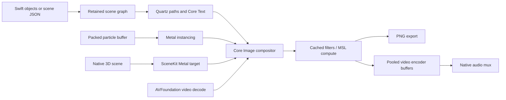

# Processing / p5 → native Swift capability map

Audit: 2026-10-02. The removed browser backend used **p5.js 2.3.3**, confirmed before removal in the installed package and lockfile, rather than the archived Processing.js Java-to-JavaScript port. Processing Java, Processing.js, and p5.js have different APIs. The current online p5 reference also contains APIs beyond the pinned runtime. This is a native authoring toolkit and migration map, not a JavaScript/Processing interpreter or a claim of complete p5 API compatibility.

Reference indexes checked: [p5](https://p5js.org/reference/), [Processing](https://processing.org/reference/), and the [archived Processing.js repository](https://github.com/processing-js/processing-js). The code audit also covers all six local `tools/p5/lib/*.js` extensions, both examples, `render.mjs`, the Ruby animation/overlay services, and the Swift VFX package.

**Current runtime:** entirely Swift for drawing, layering, VFX, video decode/encode and audio interleaving. The browser renderer, p5/Puppeteer packages, npm manifests and installed node_modules have been removed. Old JavaScript scenes must be rewritten as native scene JSON or Swift code.

## What existed here

`Media::Anim` → Node → Puppeteer/Chrome → p5 Canvas2D → PNG data URL → base64 decode → PNG file per frame → FFmpeg composition. The renderer creates a 2D canvas with pixel density 1 and supplies absolute frame time. It seeds random per frame and noise per render. The underlying p5 package contains WebGL functionality, but this runner does not create a WebGL canvas automatically.

The extension modules are small creative helpers, not another renderer. Text, paper, sprite and trace shapes still run through Canvas2D. Grain reads and rewrites every pixel in JavaScript. All frames of each sprite clip are preloaded. The existing `mvfx` package used native Core Image for camera/blur/glow/signal postprocessing, while decoded/encoded video travels through FFmpeg raw BGRA pipes. Its former light overlay used p5. It now uses cached native paths/gradients with no PNG light files, and AVFoundation replaces the raw-video pipes.

## Implemented primitive map

The drawing interfaces below live in [MotionGraphics](../.claude/skills/motion-graphics-music-video-noimage/scripts/tools/graphics). “Native” describes implementation, not guaranteed speed. These are corresponding operations, with documented native coordinate/style conventions rather than identical argument signatures.

| Primitive | Swift implementation | Scene JSON |
| --- | --- | --- |
| Point | `Canvas.point`, stroke-sized disc | `point` |
| Line | `Canvas.line`, retained open `Path` | `line`, exactly two points |
| Triangle | `Canvas.triangle`, closed path | `triangle`, exactly three points |
| Quad | `Canvas.quad`, closed path | `quad`, exactly four points |
| Rectangle / rounded rectangle | `Canvas.rect`, `Path.rect` | `rect`, optional corner radius |
| Square | `Canvas.square` | `square` |
| Circle | `Canvas.circle`, retained ellipse path | `circle` |
| Ellipse | `Canvas.ellipse`, `Path.ellipse` | `ellipse` |
| Arc / chord / pie | `Path.arc`; affine scaling supports ellipses | `arc`, open/chord/pie |
| Cubic Bézier | `Path.cubic`; point/tangent evaluation | `path` C commands |
| Quadratic Bézier | `Path.quadratic` | `path` Q commands |
| Catmull–Rom curve | `Path.spline`, converted to cubic segments | `spline` |
| Arbitrary polygon / contour | `Path.move/line/close`, multiple subpaths, winding/even-odd | `polygon`, `path`, evenOdd |
| Box | `Scene3D.add(.box)` → SCNBox | Swift only |
| Sphere | `.sphere` → SCNSphere | Swift only |
| Ellipsoid | `.ellipsoid` → scaled sphere | Swift only |
| Plane | `.plane` → SCNPlane | Swift only |
| Cone | `.cone` → SCNCone | Swift only |
| Cylinder | `.cylinder` → SCNCylinder | Swift only |
| Torus | `.torus` → SCNTorus | Swift only |
| Custom mesh / model | native SCNGeometry; `Scene3D.loadModel` for SceneKit-supported files | Swift only |

Line caps, joins, width, dash phase, antialiasing and native fill rules are exposed through `Style`/`Canvas.context`. Rectangles use corner coordinates, ellipses center coordinates, and text a baseline. There are no global `rectMode`/`ellipseMode` switches. Shape construction uses objects instead of a global begin/end state machine. Native curves do not need manual tessellation detail knobs for 2D.

## Capability families and boundaries

| Family | Available now in Swift | Boundary / extension point |
| --- | --- | --- |
| Paint/color | RGBA, hex, HSB, interpolation, opacity, linear/radial gradients, fill/stroke | No p5 color-mode global or CSS color parser; SDR output |
| Transforms/state | Scoped save/restore, translate, rotate, scale, shear, affine matrices, anchors, hierarchical groups | Use simd/SCNNode for 3D transforms; no global angle-mode switch |
| Paths/geometry | Retained paths, curves, contours, clipping, cached generated shapes | SVG import/export and arbitrary-order Béziers are not implemented |
| Typography | Core Text shaping/fallback, font registration, metrics, glyph paths, outlines, tracking, spatial reveal, karaoke | Paragraph wrapping, variable-axis controls, text-to-3D wrappers and text point sampling remain native Core Text/SceneKit work |
| Images | ImageIO decode, cached assets, native draw/scale, bounded sprite cache, PNG export | No GIF/WebP animation wrapper; no JavaScript image object emulation |
| Pixels | Native CGContext memory for explicit CPU operations; MetalEffect for image-wide GPU work | Pixel access is available through the native context; no p5 pixels-array facade |
| Offscreen surfaces | Reusable Canvas, CIImage composition, retained Metal targets | No live canvas DOM or automatic framebuffer sizing |
| Masks/blends | Vector clips, isolated group opacity, ten image blend modes, CI alpha masks, erase blend | JSON exposes vector clipping; image masks use the Swift compositor API |
| Image filters | Reusable Core Image filter chain, fused signal/grain pass, custom MSL compute | Frame-cued `mvfx` shares the native graphics library; effect chains crop at canvas edges |
| Animation/lifecycle | Scene construction once, absolute FrameTime, keyframes/easing/repeat, visibility intervals, analytic Node updates | No JavaScript setup/draw interpreter; custom callbacks must avoid accumulating state for random access |
| Math | Swift standard math + simd vectors/matrices/quaternions, seeded random/Gaussian and gradient noise | RNG/noise values differ from p5; noise implementation is 2D |
| 3D | Primitive meshes, imported geometry, scene hierarchy, native materials/textures/lights/camera, Metal target | SceneKit adapter, not a new general-purpose 3D engine; SceneKit is deprecated in current SDKs |
| Shaders/compute | MSL compute kernel extension and instanced particle vertex/fragment shaders | GLSL and p5.strands programs require porting; no shader-hook compatibility facade |
| Particles | One packed buffer per field and one instanced draw; absolute-time GPU motion | Reusable output texture; no full physics engine, sorting, collisions or trails system |
| Video | Sequential AVFoundation decode, orientation, crop-to-fill, CI overlays, pooled buffers, H.264/HEVC/ProRes 4444, audio passthrough mux | VideoSource needs forward time; no timeline editor, capture UI or HDR mastering; non-AAC audio encodes to AAC in memory |
| Audio | Streaming RMS, peaks, spectrum bands via AVFoundation/Accelerate; waveform drawing; beat-phase utility | Native analyzer does not detect beats or synthesize sound; existing beat/SFX tools remain |
| I/O | Foundation/JSON, local assets, exported images/movies | No DOM, HTTP helper facade, XML/table emulation or browser storage |
| Interaction/accessibility | Library can be hosted inside a native app | Mouse/touch/gamepad/device events, GUI widgets and accessibility UI are outside this offline renderer |

The 3D adapter follows Apple's [SCNRenderer Metal render-pass API](https://developer.apple.com/documentation/scenekit/scnrenderer/render%28attime%3Aviewport%3Acommandbuffer%3Apassdescriptor%3A%29). Its deprecation is why it is isolated. Context/resource reuse follows Apple's [Core Image performance guidance](https://developer.apple.com/library/archive/documentation/GraphicsImaging/Conceptual/CoreImaging/ci_performance/ci_performance.html). Video buffers use [AVAssetWriterInputPixelBufferAdaptor](https://developer.apple.com/documentation/avfoundation/avassetwriterinputpixelbufferadaptor). Encoder color conversion uses a color space synthesized from the same Rec.709 buffer tags via [CVImageBufferCreateColorSpaceFromAttachments](https://developer.apple.com/documentation/corevideo/cvimagebuffercreatecolorspacefromattachments(_:)), avoiding mismatched transfer metadata. Existing VFX cue blending remains in nonlinear RGB; new compositions default to linear-light processing.

## Every existing local helper and its native route

These helpers were reviewed directly from the repository, including their timing and caching behavior. Correspondence is functional, not pixel- or seed-identical.

| Existing extension | Native replacement / migration |
| --- | --- |
| `Anim.sketch`, `renderFrame`, frame clock | Scene + reusable Canvas + FrameTime; CLI uses exact frame indices |
| `fonts`, `data` | TextLayout.registerFont; SceneDocument external data dictionary |
| `clip`, `frame`, `at`, `draw` | SpriteSequence with clamped/looped absolute-time lookup; 8-frame LRU rather than preloading the clip |
| Sprite `place` using src/box | Set rect/position from the same crop metadata in Swift; not automatic in JSON |
| `cues` and occurrence lookup | CueSheet; invalid/missing words throw |
| `rng` | Random seeded generator; deliberately different sequence |
| `at` with scale/rotation/alpha | Node transforms/anchors and isolated group alpha, or Canvas.withState |
| linear/inCubic/outCubic/inOutCubic/outExpo/outBack/outElastic | Easing cases, plus smooth |
| clamp01/progress/tween | Swift min/max; Motion.progress; Track interpolation |
| live/envelope | Node start/end; Motion.envelope |
| steps/sinceStep | Compute from FrameTime with floor/remainder; no dedicated wrapper |
| knockout | TextNode outline + fill; glyph outlines available for custom offsets |
| typed | Motion.typed uses Unicode grapheme clusters |
| typedWords | CueSheet + Motion.typed per cue in a custom Node; no ready-made JSON helper |
| karaoke/karaokeWidth | KaraokeNode caches shaped words; TextLayout widths available; active-font weight switching is not ported |
| slipPath/slip | Seeded Path.paper + ShapeNode; native CGContext shadow is available; individual torn-edge selection is not ported |
| misregister | Designs.misregister with retained shared path |
| grain | SignalEffect's seeded GPU alpha grain; visual analogue, not identical JS PRNG/cell pattern |
| slap/pop/slam | Designs.entrance + Track; available through JSON entrance |
| shake | Motion.shake is deterministic for frame+seed |
| sparkle/twinkle | Path.star plus transforms/opacity tracks; burst choreography is authored rather than a signature-compatible helper |
| trace | TraceNode caches segment lengths, reveals by distance and draws its head; per-vertex solder dots can be authored as children |
| lights example: leak/flare/glints | Designs.flare, cached gradients, stars and MetalParticles provide native building blocks; existing leak/flare/glints VFX cues now drive NativeLights directly in memory |
| smoke example | A typography/paper/trace/sparkle demonstration, not a smoke simulator; those ingredients have the routes above |

## Architecture and performance choices

The diagram describes library composition options. The CLI's fixed order is scene → particles → effects → plate composition → output. Custom Swift applications can reorder layers/effects.

Logical objects own resources; bulk data stays packed. The new toolkit retains paths/text/gradients, compiles shaders once and reuses explicit FilterEffect objects. The existing cued VFX engine continues to construct lazy Core Image filter graphs for active effects. Sprite cache size is bounded. Video decoding keeps a current frame and lookahead; encoding consumes frames continuously. Canvas2D and Quartz bitmap paths both rasterize on the CPU: the gain here includes removal of browser RPC/base64/PNG transport and allocation overhead, not a claim that Quartz is always GPU-accelerated. Metal stages currently synchronize at stage boundaries for safe texture reuse. Further throughput work should profile upload costs, raster caching and command-buffer pipelining rather than add per-particle classes.

### Measured on this host

Apple M4, macOS 26.6.2, release build, p5 2.3.3. Matched 500 circles with a rotating parent, 48 PNG frames, 1920×1080. Three sequential runs per backend; external wall time includes process startup. Native and browser rasterization/compression are not pixel-identical. This measures the **repository export paths**, not universal p5-vs-Metal performance.

| Backend | Wall seconds, three runs | Median | Median throughput |
| --- | --- | --- | --- |
| Native Swift → PNG | 1.042, 1.247, 1.387 | 1.247 s | 38.5 fps |
| Existing p5/Chrome → PNG | 3.622, 3.188, 2.318 | 3.188 s | 15.1 fps |

Native was **2.56× faster** on this workload. Run-order/cache effects and PNG compression matter; this is a local measurement, not a guaranteed speedup. Reproducible fixtures: [native JSON](../.claude/skills/motion-graphics-music-video-noimage/scripts/tools/graphics/examples/benchmark.json) (the matching browser fixture was removed with its backend after measurement). The full futuristic example (grid, HUD rings, typography, paths, flare and bloom) exported 192 1080p H.264 frames in 4.910 s after initialization (39.1 fps); ffprobe verified exactly 192 frames and 8.000 s. No comparison to an equivalent p5 version of that scene was performed.

## Using it in production

See the [toolkit guide](../.claude/skills/motion-graphics-music-video-noimage/scripts/tools/graphics/README.md) for build commands, complete JSON field reference, Swift subclassing, codec/alpha rules and examples. Prefer the direct movie path for finished videos and transparent ProRes for editing applications. Use PNG sequences only for explicit external interchange or review; the default overlay/VFX pipeline does not need them. The default overlay and VFX movie paths stream audio and picture through the same native writer. Only explicit PNG exports/review stills create frame images. There is no browser fallback or JavaScript source conversion.

Validation after migration: 51 offline Ruby examples and all 21 Swift graphics tests pass on this host. This includes Metal particles/compute/3D, alpha export, decoded frame counts, color round trips, PCM trimming, AAC passthrough/EOF, native VFX clips/stills and a still-image overlay with no intermediate movie or frame directory. Paid live generation was not run.
